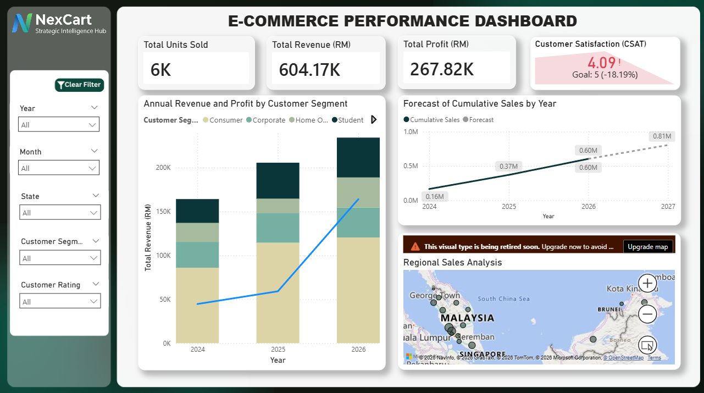
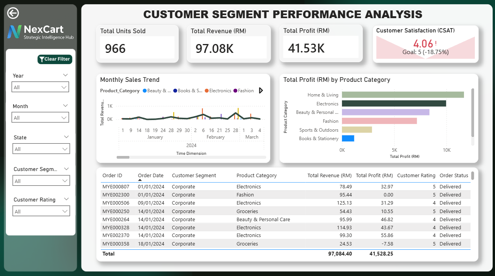

# E-Commerce Performance Dashboard

An interactive **E-Commerce Performance Dashboard** developed using **Microsoft Power BI** to visualize and analyze business performance across the Malaysian market.

The dashboard uses a synthetically generated dataset and focuses on key business metrics such as revenue, profit, units sold, customer satisfaction, customer segments, product performance, and regional sales.

## Dashboard Preview

### Main Dashboard

### Customer Segment Performance Analysis

## Features

* **KPI & Summary Cards**

  * Total Units Sold
  * Total Revenue
  * Total Profit
  * Customer Satisfaction (CSAT)

* **Interactive Filtering**

  * Year
  * Month
  * State
  * Customer Segment
  * Customer Rating

* **Interactive Visualizations**

  * Revenue and profit by customer segment
  * Cumulative sales and revenue forecasting
  * Regional sales analysis across Malaysia

* **Drill-Down Analysis**

  * Explore yearly performance down to monthly performance using Power BI date hierarchy.

* **Drill-Through Analysis**

  * Navigate from the main dashboard to a dedicated customer segment analysis page containing detailed charts and transaction-level information.

* **Cross-Filtering**

  * Selecting data from one visual automatically updates related visuals.

* **Dynamic Visuals**

  * Charts and KPI values dynamically respond to filters and user selections.

* **User-Friendly Navigation**

  * Clear dashboard titles
  * Clear filter button
  * Back navigation button
  * Interactive map controls

## Key Technologies

* **Microsoft Power BI**
* **DAX**
* Data visualization
* Interactive dashboard design
* Synthetic dataset generation

## Dashboard Structure

### Main Dashboard

The main dashboard provides an overview of overall e-commerce performance through KPI cards, customer segment analysis, sales forecasting, and regional sales distribution.

### Customer Segment Performance Analysis

The drill-through page provides a deeper analysis of a selected customer segment, including:

* Monthly revenue and profit trends
* Profit by product category
* Detailed transaction information
* Customer ratings
* Order status

## Key DAX Concepts

The dashboard uses DAX measures for cumulative sales and forecasting calculations, including functions such as:

* `CALCULATE`
* `SUM`
* `FILTER`
* `ALLSELECTED`

## Dataset

The dataset used in this project is **synthetically generated** for educational and analytical purposes. It represents e-commerce transactions across Malaysia from 2024 to 2026, with selected projections extending into 2027.

The dataset includes information such as:

* Order date
* State
* Customer segment
* Product category
* Revenue
* Profit
* Units sold
* Customer rating
* Order status

## Purpose

This project demonstrates the use of **Power BI for interactive business intelligence and exploratory data analysis**, with an emphasis on transforming transactional data into an interactive dashboard for business performance analysis.

## Disclaimer

The company name **"NexCart"**, dataset, and business information presented in this project are fictional and created for educational purposes.
